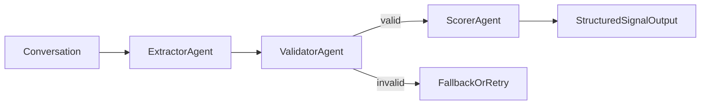

# Casino Signal Detector

Detects and scores structured signals from casino host-to-guest conversations.

## Signal categories

| Category | Description | Example |
|---|---|---|
| `intent` | Booking / visit intent | "Planning a trip for March" |
| `value` | Spending capacity / group size | "We always book the penthouse" |
| `sentiment` | Positive or negative experience | "Had an amazing time" |
| `life_event` | Personal milestones | "Anniversary next month" |
| `competitive` | Mentions of other properties | "Wynn offered me a suite" |

## Architecture (LLM-First + XGBoost Scoring)

```
Raw conversations (MultiWOZ + synthetic)
      │
      ▼
[LLM extraction]
  • conversation -> canonical JSON schema
  • per-signal detected/confidence/evidence
      │
      ▼
[Training table]
  • label_* targets (multi-label)
  • feat_* extraction features
  • guest_text for embedding features
      │
      ▼
[XGBoost (×5)]
  • one binary classifier per signal category
  • Optuna tuning + probability calibration
      │
      ▼
Inference:
  conversation -> LLM extraction -> feature row -> XGBoost confidence scores
```

## Data and Preprocessing Strategy (Reduction + Adaptation)

No casino-native labeled dataset was provided, so the pipeline uses a reduction strategy:

1. **Reduce to a related domain with available dialogues**  
   Use `MultiWOZ_2.2` hotel/restaurant conversations as a base corpus for realistic multi-turn intent/value/sentiment patterns.

2. **Adapt to casino domain with synthetic augmentation**  
   Generate casino host-guest conversations (VIP, comp offers, life events, competitive mentions) to cover underrepresented signals (`life_event`, `competitive`) and casino-specific wording.

3. **Normalize all sources into one canonical schema**  
   Convert both sources to a shared conversation format and signal schema, then merge and deduplicate.

4. **LLM-assisted preprocessing to structured features**  
   Extract `guest_text` + per-signal evidence/confidence JSON, validate schema, flatten into training table (`label_*`, `feat_*`, `guest_text`).

5. **Train/evaluate on held-out split**  
   Use calibrated XGBoost classifiers (one per signal), then run final held-out inference evaluation with per-signal metrics.

### Why this approach

- Real dialogues from MultiWOZ improve linguistic realism and reduce over-reliance on fully synthetic text.
- Synthetic casino data improves coverage for sparse but business-critical categories.
- Canonical schema keeps train/inference consistent and auditable.

### Trade-offs and Risks

- **Domain shift**: MultiWOZ is travel-focused, not casino-native; vocabulary and intent priors differ.
- **Label noise**: LLM extraction introduces probabilistic labeling errors.
- **Class imbalance**: Some signals (especially `life_event`, sometimes `competitive`) remain sparse.
- **Mitigation used**:
  - source-wise metrics (`source_macro_metrics.csv`)
  - strict schema validation + confidence gates
  - leakage controls in training features
  - final held-out evaluation artifacts for transparent reporting

### What the system returns (assignment deliverable)

For each conversation, the model returns per-signal confidence:

```json
[
  {"category":"intent","confidence":0.91,"triggered":true},
  {"category":"value","confidence":0.78,"triggered":true},
  {"category":"sentiment","confidence":0.22,"triggered":false},
  {"category":"life_event","confidence":0.64,"triggered":true},
  {"category":"competitive","confidence":0.08,"triggered":false}
]
```

### Multi-Agent Workflow (book-aligned, deterministic)

For interview framing, this can be described as a 3-agent workflow:

1. **ExtractorAgent**: conversation -> canonical signal JSON  
2. **ValidatorAgent**: schema + confidence + evidence checks  
3. **ScorerAgent**: XGBoost calibrated confidence per signal



Code entrypoint: `src/agent_workflow.py`

## Quickstart

### 1. Install dependencies

```bash
python -m venv .venv
# Windows
.venv\Scripts\activate
# Mac/Linux
source .venv/bin/activate

pip install -r requirements.txt
```

### 2. Configure OpenAI API key

Create a `.env` file in the project root:

```bash
cp .env .env
# Edit .env and set:
# OPENAI_API_KEY=sk-xxxxxxxxxxxxxxxx
```

PyCharm alternative: `Run Configuration -> Environment variables` add:

```bash
OPENAI_API_KEY=sk-xxxxxxxxxxxxxxxx
```

Recommended PyCharm run-config environment variables:

- `OPENAI_API_KEY=...` (required for extraction/synthetic generation)
- `PYTHONUNBUFFERED=1` (optional, cleaner live logs in run console)

### 3. Generate synthetic data (optional top-up)

```bash
python src/generate_data.py --n_total 300 --output data/raw/conversations.json --model gpt-4o-mini --min_confidence_hint 0.75
```

Use this to top up weak categories after MultiWOZ conversion.
The generator now includes richer scenario templates, harder multi-signal combinations,
and confidence/evidence quality filtering.

### 3b. Build data from MultiWOZ 2.2 (recommended real-data base)

If you already have `data/MultiWOZ_2.2`, convert hotel/restaurant dialogues:

```bash
python src/build_dataset_multiwoz.py \
  --multiwoz_dir data/MultiWOZ_2.2 \
  --output data/raw/conversations_multiwoz.json \
  --services hotel restaurant \
  --splits train dev test
```

This produces the same schema as synthetic data so both can be combined later.

### 4. Merge datasets

```bash
python src/merge_datasets.py --inputs data/raw/conversations_multiwoz.json data/raw/conversations.json --output data/raw/conversations_merged.json
```

Recommended interview baseline:
- `--max_records 700` for MultiWOZ conversion
- `--n_total 300` for synthetic top-up
- total merged ≈ 1000 conversations (real-heavy hybrid)

### 5. LLM extraction -> canonical JSONL

```bash
python src/extract_with_llm.py --input data/raw/conversations_merged.json --output_jsonl data/processed/extractions.jsonl --cache_path data/processed/extraction_cache.jsonl --report_path data/processed/extraction_report.json --model gpt-4o-mini
```

### 6. Flatten extraction to training table

```bash
python src/prepare_training_table.py --input_jsonl data/processed/extractions.jsonl --output_csv data/processed/training_table.csv --summary_json data/processed/training_table_summary.json
```

### 7. Train with Optuna (LLM table mode)

```bash
python src/train.py --table_csv data/processed/training_table.csv --n_trials 60
```

Trains one XGBClassifier per signal category, tunes with Optuna, calibrates
probabilities, and prints held-out test results (including Brier + logloss).

### 8. Pipeline evaluation report

```bash
python src/evaluate_pipeline.py --extraction_report data/processed/extraction_report.json --model_eval_csv models/evaluation.csv --output data/processed/pipeline_evaluation.json
```

### 8b. Final held-out inference evaluation (submission-ready)

```bash
python src/final_eval.py --table_csv data/processed/training_table.csv --model_dir models --splits data/processed/splits.npz --output_dir data/processed/final_eval --sample_size 10
```

Outputs:
- `data/processed/final_eval/final_eval_summary.json`
- `data/processed/final_eval/category_metrics.csv`
- `data/processed/final_eval/source_macro_metrics.csv`
- `data/processed/final_eval/sample_predictions.json`
- `data/processed/final_eval/prediction_table.csv` (row-level y_true/y_prob/y_pred for graphs)

### One-command full pipeline

Use this for an end-to-end rerun (fresh extraction labels + final eval artifacts):

```bash
python src/run_pipeline_local_cpp.py --provider openai --extract_model gpt-4o-mini --synthetic_model gpt-4o-mini --multiwoz_records 700 --synthetic_records 300 --n_trials 60 --fresh_extraction_cache --run_final_eval --sample_size 10
```

### 9. Run the notebooks

```bash
jupyter notebook
```

- `notebooks/01_eda.ipynb` — dataset exploration, distributions, co-occurrence
- `notebooks/02_training_eval.ipynb` — full training pipeline, Optuna plots,
  ROC curves, confusion matrices, feature importance, sample predictions,
  and final held-out inference evaluation section
- `notebooks/03_preprocessing_qa.ipynb` — assignment-ready preprocessing QA
  (source mix, extraction quality, schema checks, split preview)

### Where results are saved

- **Model files**: `models/xgb_<category>.joblib`
- **Training evaluation**: `models/evaluation.csv`
- **Pipeline report**: `data/processed/pipeline_evaluation.json`
- **Final submission eval**:
  - `data/processed/final_eval/final_eval_summary.json`
  - `data/processed/final_eval/category_metrics.csv`
  - `data/processed/final_eval/source_macro_metrics.csv`
  - `data/processed/final_eval/sample_predictions.json`
  - `data/processed/final_eval/prediction_table.csv`

### 10. Run inference on a conversation

```python
from src.predict import SignalDetector

detector = SignalDetector(
    use_llm_extractor=True,
    llm_model="gpt-4o-mini",
)
conversation = [
    {"role": "host",  "content": "Hi John! What can we do for you?"},
    {"role": "guest", "content": "I want to book the penthouse for March. Budget isn't a concern."},
]
results = detector.detect(conversation)
# [
#   {"category": "intent", "confidence": 0.91, "triggered": True},
#   {"category": "value",  "confidence": 0.87, "triggered": True},
#   ...
# ]
```

Or demo directly:

```bash
python src/predict.py
```

Multi-agent workflow demo:

```bash
python src/agent_workflow.py
```

## PyCharm vs Jupyter (what to do where)

### Use PyCharm scripts for reproducible pipeline steps

Run these from terminal / PyCharm run configs:

```bash
python src/run_pipeline_local_cpp.py --provider openai --extract_model gpt-4o-mini --multiwoz_records 1200 --synthetic_records 800 --n_trials 60
```

This script orchestrates end-to-end:
- MultiWOZ conversion
- Synthetic top-up
- Merge
- LLM extraction
- Table generation
- XGBoost training
- Pipeline report

### Use Jupyter for analysis and presentation

- `01_eda.ipynb`: explain dataset characteristics
- `03_preprocessing_qa.ipynb`: prove preprocessing quality
- `02_training_eval.ipynb`: show model quality and diagnostics

Interview tip: run pipeline in PyCharm first, then present the 3 notebooks.

## Evaluation methodology

- **Single 80/20 split** shared across all categories (reproducible via saved indices)
- **Optuna** tunes on train fold only (5-fold CV F1), never sees test data
- **Metrics**: Precision, Recall, F1, ROC-AUC, Brier, LogLoss per category + macro averages
- **Pipeline report** includes extraction failure slices + classification metrics
- **Calibration**: Platt scaling ensures confidence scores are well-calibrated probabilities

## Project structure

```
casino_detector/
├── data/
│   ├── raw/                  # conversations.json (generated)
│   └── processed/            # features.npz, labels.csv, plots
├── src/
│   ├── generate_data.py      # OpenAI synthetic data generation
│   ├── build_dataset_multiwoz.py  # MultiWOZ conversion
│   ├── merge_datasets.py      # Merge raw datasets
│   ├── extract_with_llm.py    # offline LLM extraction + caching
│   ├── prepare_training_table.py # flatten extraction to training table
│   ├── infer_extract_llm.py   # online LLM extraction helper
│   ├── signal_schema.py       # canonical extraction schema
│   ├── extraction_features.py # shared extraction feature engineering
│   ├── features.py           # sentence embeddings + keyword features
│   ├── train.py              # XGBoost + Optuna training
│   ├── evaluate_pipeline.py  # extraction+classification report
│   └── predict.py            # inference pipeline
├── notebooks/
│   ├── 01_eda.ipynb          # exploratory data analysis
│   └── 02_training_eval.ipynb # full training + evaluation visualisations
├── models/                   # saved models + Optuna studies
├── .env.example
├── requirements.txt
└── README.md
```